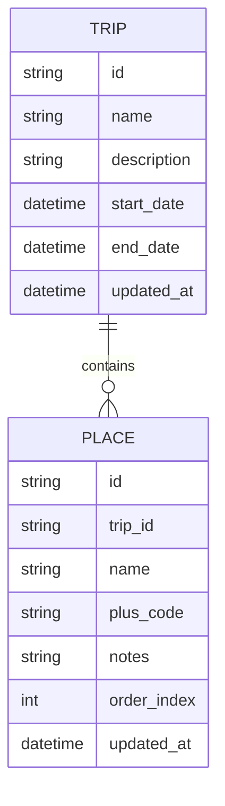

# Travo - Trip Planner App

## Overview
A lightweight, privacy-friendly trip planner app to organize itineraries offline-first, with optional cloud sync via Supabase. The app allows users to manage trips, add and reorder places, store notes and tips, and integrate Google Maps Plus Codes for location precision.

---

## 🧩 Core Requirements

### Functional
- Create, view, and edit **trips**
- Add **places** (with Plus Code, name, and description)
- Reorder places within a trip (manual drag-and-drop)
- Add **notes/tips** at both:
  - Trip level
  - Place level
- Local offline support (IndexedDB)
- Sync to cloud (Supabase) when online

### Non-functional
- Offline-first performance
- Responsive (desktop + mobile web)
- Minimalist, clean UI using ShadCN + Tailwind

---

## 💡 Nice-to-Have Features (Post-MVP)
- Embedded Google Maps search and selection  
- Smart trip insights (travel time, best route)  
- Collaborative trip editing (multi-user sync)  
- Export/share trip itinerary as PDF  
- AI-generated travel recommendations (e.g., “fill gaps in trip”)  

---

## 🧠 Solution Approach

### 1. Frontend
- Built with **React + TypeScript**
- **UI Framework:** ShadCN + Tailwind CSS
- **State Management:** React Query for sync, Zustand or Context for UI state
- **Storage:**
  - IndexedDB (local offline data)
  - Supabase (cloud sync)

### 2. Backend
- **FastAPI** for scheduled background tasks (batch jobs, backups, optional analytics)
- Hosted on **Azure**, leveraging existing credits

### 3. Sync Model
- Local-first → sync when online
- Each trip and place record includes:
  - UUID
  - `updated_at` timestamp for conflict resolution

---

## 🌍 Location Data
- Each place stored with a **Plus Code** (from Google Maps)
- Example:
  ```json
  {
    "name": "Tokyo Skytree",
    "plus_code": "8Q7XQXXR+33",
    "notes": "Great city view at sunset"
  }
  ```
- Plus Codes are compact, offline-friendly, and can be resolved via Google Maps URLs.

---

## 📱 Cross-Platform Strategy
- Single **React + Vite** app works on web and mobile browsers
- For mobile packaging:
  - Optional: Use **Capacitor** to wrap as a native app (later phase)

---

## 🛠️ Tech Stack Summary

| Layer | Technology | Notes |
|-------|-------------|-------|
| Frontend | React + TypeScript | SPA with local-first UX |
| UI | ShadCN + Tailwind CSS | Clean, component-driven design |
| State | React Query + Zustand | Efficient data management |
| Local DB | IndexedDB | Offline storage |
| Cloud DB | Supabase | Sync + Auth (if needed) |
| Backend | FastAPI | For background jobs |
| Hosting | Azure | Free credits for backend |

---

## 🔄 Data Model (MVP)



---

## ✅ MVP Scope
- Trip creation and listing
- Add, view, reorder, delete places
- Notes at trip and place levels
- IndexedDB persistence
- Optional Supabase sync

---

## 🚀 Future Enhancements
- Map-based place picker
- Intelligent route planner
- Trip sharing and collaboration
- AI insights on trip efficiency

---
