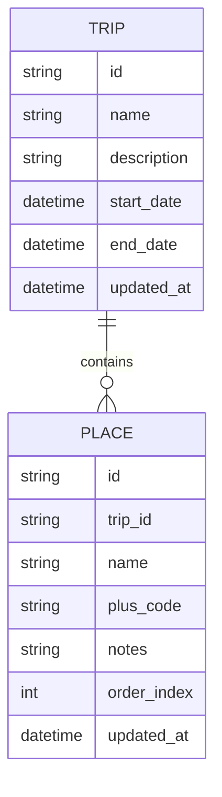

# Travo - Trip Planner App

## Overview
A lightweight, privacy-friendly trip planner app to organize itineraries offline-first. Built with Next.js and DaisyUI for a clean, simple codebase. The app allows users to view trips and places with Google Maps Plus Codes for location precision.

## 🚀 Quick Start

```bash
cd travo-nextjs
npm install
npm run dev              # Start with default theme
npm run dev:blue         # Start with blue theme
```

Visit http://localhost:3000

For detailed setup and deployment, see [travo-nextjs/README.md](./travo-nextjs/README.md)

---

## 🧩 Current Features (MVP)

### Functional

- View **trips** with details (name, dates, description)
- View **places** within trips (with Plus Code, name, notes)
- Multiple color themes (default, blue, green, red, violet)
- Offline-first with static export
- Responsive design (desktop + mobile)

### Non-functional

- Fast page loads with Next.js static generation
- Clean, minimalist UI using DaisyUI + Tailwind
- TypeScript type safety throughout
- Simple codebase with reduced complexity

---

## 💡 Future Enhancements

- Create, edit, and delete trips
- Add and reorder places within trips
- Persistent storage (IndexedDB or Supabase)
- Embedded Google Maps search and selection  
- Smart trip insights (travel time, best route)  
- Collaborative trip editing (multi-user sync)  
- Export/share trip itinerary as PDF  
- AI-generated travel recommendations

---

## 🛠️ Tech Stack

| Layer | Technology | Notes |
|-------|-------------|-------|
| Framework | Next.js 15 | App Router with static export |
| Language | TypeScript 5 | Strict mode enabled |
| UI Library | DaisyUI 5 | Simplified component styling |
| Styling | Tailwind CSS 3 | Utility-first CSS |
| Icons | Lucide React | Lightweight icon library |

---

## 🌍 Location Data

Each place is stored with a **Plus Code** (from Google Maps):

```json
{
  "name": "Tokyo Skytree",
  "plus_code": "8Q7XQXXR+33",
  "notes": "Great city view at sunset"
}
```

Plus Codes are compact, offline-friendly, and can be resolved via Google Maps URLs

---

## 🔄 Data Model (MVP)



---

## 📂 Project Structure

```
travo-nextjs/          # Next.js application
  ├── app/             # App Router pages
  ├── components/      # React components
  ├── data/            # trips.json data file
  ├── lib/             # Utility functions
  └── types/           # TypeScript interfaces
specs/                 # Feature specifications
```

---

## � Documentation

- [Quick Start Guide](./travo-nextjs/README.md)
- [Feature Specifications](./specs/)
- [Technical Architecture](./TECHNICAL_ARCHITECTURE.md)

---
